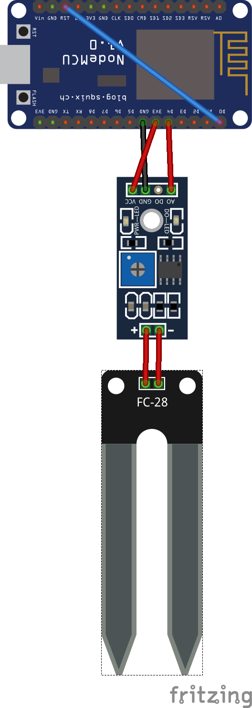

# Solid Humidity MQTT Sensor

Publish the Solid Humidity Information all minute to a central MQTT topic `/iot/flower`, after than the NodeMCU go in the DeepSleep mode.

```json
{"soil_humidity":362,"device_id":"flower-livingroom","sensor":17}
```

## Wiring



## Hardware

 - NodeMCU Deleloper Board
 - SODIAL (R) Boden Hygrometer
